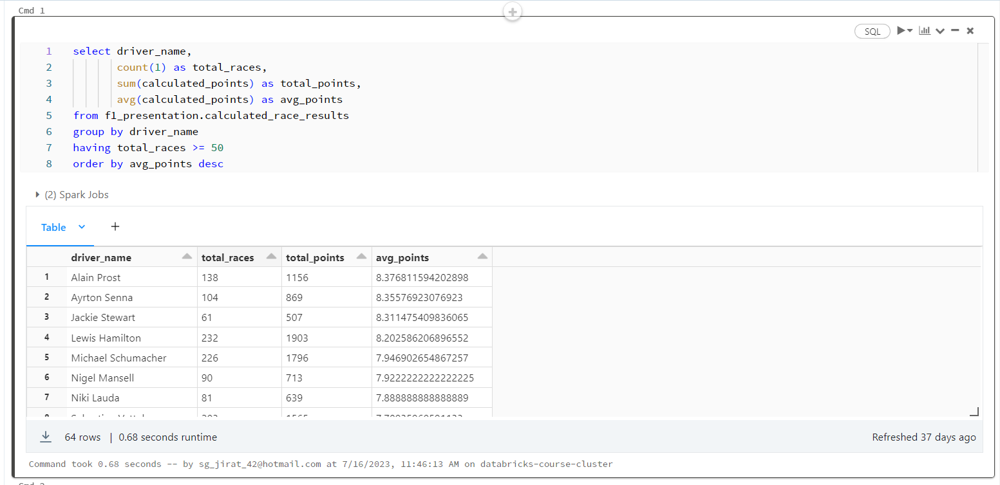
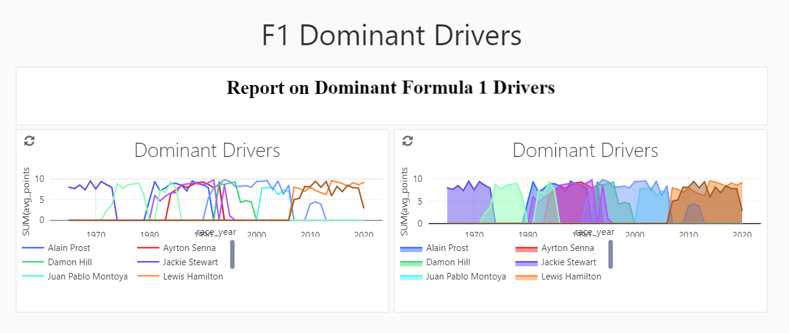
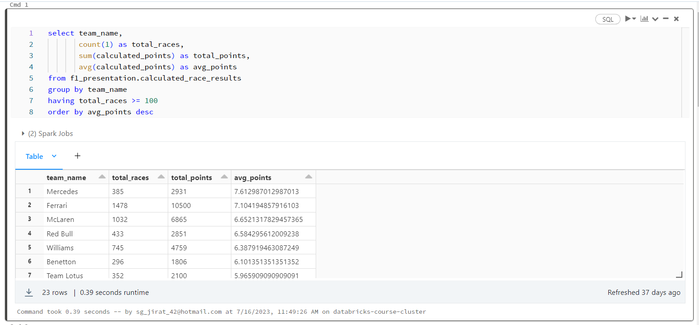
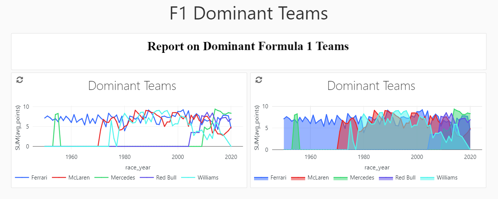

<h1>Formula 1 Data Analysis Project</h1>

<h2>Introduction</h2>

Welcome to Formula 1 Data Analysis Project repository. This project is part of the Udemy course "Azure Databricks & Spark Core for Data Engineers." The course focused on leveraging Azure Databricks and Apache Spark to perform advanced data engineering tasks and analyses. This repository showcases the hands-on work completed during the course.

<h2>Project Overview</h2>

In this project, we explore the power of Azure Databricks and Spark Core by working on various real-world data engineering tasks. The main goals of the project include:

<ul>
  <li>Implementing data transformation and processing using Databricks notebooks.</li>
  <li>Analyzing datasets to derive meaningful insights using Apache Spark's capabilities.</li>
  <li>Demonstrating best practices in managing data pipelines.</li>
</ul>

Throughout the course, I've worked with different datasets, performed data cleansing and transformations, and visualized our findings using Databricks notebooks.

<h2>Results</h2>

<h3>Dominant Drivers</h3>

<h3>Dominant Teams</h3>

<h2>Reference</h2>
<a href>https://www.udemy.com/course/azure-databricks-spark-core-for-data-engineers/</a>
